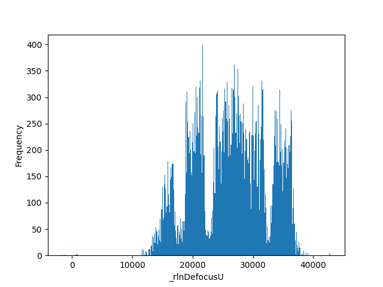
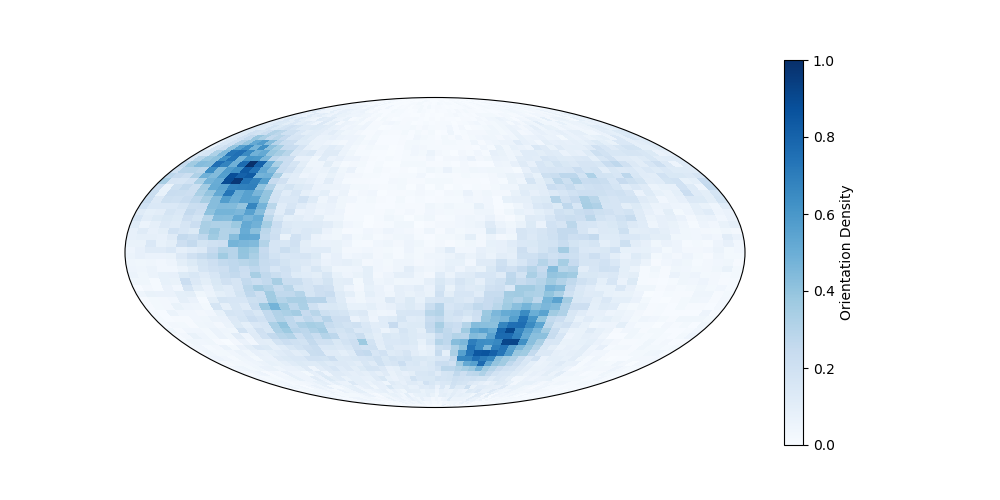
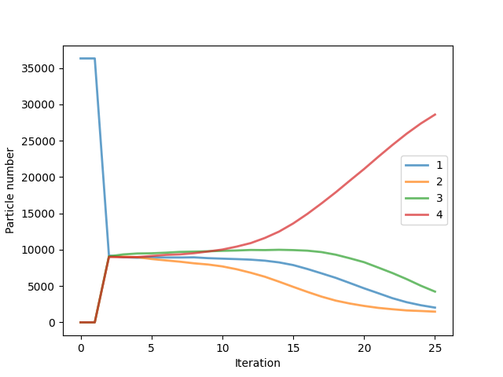
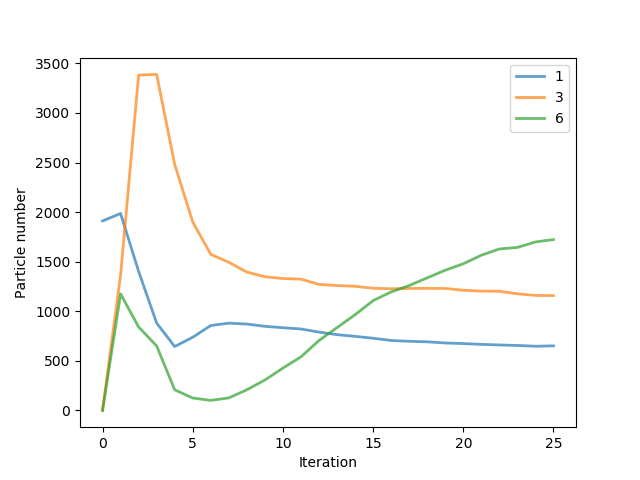
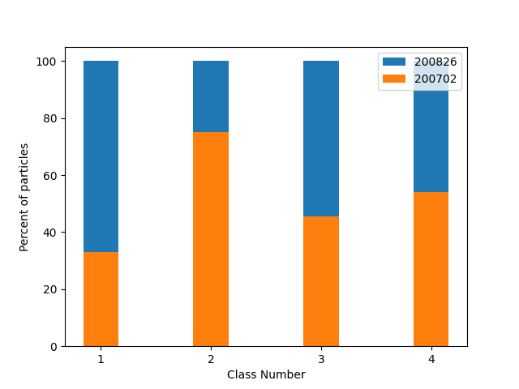

# StarParser

Use this program to manipulate Relion 3.1 star files, including counting, plotting, extracting, and filtering data. At the very least, this is a useful alternative to *awk* commands, which can get *awk*ward. See options and examples below (note: some of the options are already available in "relion_star_handler").

**Usage:**

```
python starparser.py --i input.star [options]
```

Alternatively, add an alias to your .cshrc (`alias starparser 'python /home/programs/starparser.py'`) or .bashrc (`alias starparser='python /home/programs/starparser.py'`) and run the program with:

```
starparser --i input.star [options]
```	

## Requirements

* You need to have **Python 3** installed and have the **pandas** and **matplotlib** packages. This is probably best done in a new conda environment: `conda create -n star python=3.6 pandas matplotlib`, which is activated with `conda activate star`. (Note: it has only been tested on **pandas** version 1.1.3.) You can then run the **starparser.py** program directly or with an alias.

* Your input file needs to be a standard **Relion** *.star* file with an optics table, followed by another data table (e.g. particle table), followed by a list with tab-delimited columns (i.e. it does not work on *\*\_model.star* files). Typical files include *run_data.star*, *run_itxxx_data.star*, *movies.star*, etc.

* If the star file lacks an optics table, such as those from Relion 3.0, just add the ```--opticsless``` option to parse it (see limitations below).

* The term *particles* here refers to rows in a star file, which may represent objects other than particles, such as movies in a *movies.star* file.

## Options

### Input

* **```--i```** *```filename```* : Input star file.

* **```--f```** *```filename```* : The name of another file to get information from, if necessary.

### Plotting

* **```--histogram```** *```column-name```* : Plot values of a column as a histogram. Optionally, use ```--c``` and ```--q``` to only plot a subset of particles (see the *Querying* options), otherwise it will plot all. The filename will be that of the column name. Use ```--t``` to change the filetype (see the *Output* options). The number of bins is calculated using the Freedman-Diaconis rule. Note that "relion_star_handler --hist_column" also does this.

* **```--plot_orientations```** : Plot the particle orientations based on the *\_rlnAngleRot* and *\_rlnAngleTilt* columns on a Mollweide projection (longitude and lattitude, respectively). Optionally, use ```--c``` and ```--q``` to only plot a subset of particles, otherwise it will plot all. The result will be saved to Particle_orientations.png. Use ```--t``` to change filetype (see the *Output* options).

* **```--plot_class_iterations```** *```classes```* : Plot the number of particles per class for all iterations up to the one provided in the input. Type "all" after the option to plot all classes, or separate the classes that you want with a slash (e.g. *1/2/5*). It can successfully handle filenames that have "\_ct" in them if you've continued from intermediate jobs (only tested on a single continue). Use ```--t``` to change filetype (see the *Output* options).

* **```--plot_class_proportions```** : Find the proportion of particle sets that belong to each class. At least two queries (```--q```, separated by slashes) must be provided along with the column to search in (```--c```) (See the *Querying* options). It will output the proportions in percentages and plot the result in Class_proportion.png. Use ```--t``` to change filetype (see the *Output* options).

* **```--plot_coordinates```** *```xlimit/ylimit```* :  Plot the particle coordinates for the input star file for each micrograph in a multi-page pdf (black circles). The argument to pass is the x and y limits of the plot (i.e. the size of the micrographs) in pixels (e.g. *5760/4096*). Use ```--f``` to overlay the coordinates of a second star file (blue dots); in this case, the micrograph names should match between the two star files. This option is useful to compare coordinates after filtering a dataset. The plots are output to Coordinates.pdf. Optionally, pass a third argument to specify how many micrographs to plot (e.g. *5760/4096/100* to do the first 100 micrographs).

### Modifying

* **```--operate```** *```column-name[operator]value```* : Perform operation on all values of a column. The argument to pass is column[operator]value (without the brackets and without any spaces); operators include "\*", "/", "+", and "-" (e.g. *\_rlnHelicalTrackLength\*0.25*). The result is written to a new star file (default output.star, or specified with ```--o```). If your terminal throws an error, try surrounding the argument with quotations (e.g. *"\_rlnHelicalTrackLength\*0.25"*).

* **```--delete_column```** *```column-name(s)```* : Delete column, renumber headers, and output to a new star file (default output.star, or specified with ```--o```). E.g. *\_rlnMicrographName*. To enter multiple columns, separate them with a slash: *\_rlnMicrographName/\_rlnCoordinateX*. Note that "relion_star_handler --remove_column" also does this.

* **```--delete_particles```** : Delete particles that match a query (specified with ```--q```) within a column header (specified with ```--c```; see the *Querying* options), and write to a new star file (default output.star, or specified with ```--o```).

* **```--delete_duplicates```** *```column-name```* : Delete duplicate particles based on the column provided here (e.g. *\_rlnImageName*).

* **```--delete_mics_fromlist```** : Delete particles that belong to micrographs that have a match in a second file provided by ```--f```, and write to a new star file (default output.star, or specified with ```--o```). You only need to have the micrograph names and not necessarily the full paths in the second file.

* **```--insert_column```** *```column-name```* : Insert a new column that doesn't already exist with the values found in the file provided by ```--f```. The file should be a single column and should have an equivalent number to the star file. The result is written to a new star file (default output.star, or specified with ```--o```).

* **```--replace_column```** *```column-name```* : Replace all entries of a column with a list of values found in the file provided by ```--f```. The file should be a single column and should have an equivalent number to the star file. This is useful when used in conjunction with ```--list_column```, which outputs column values for easy editing before reinsertion with ```--replace_column```. The result is written to a new star file (default output.star, or specified with ```--o```).

* **```--copy_column```** *```source-column/target-column```* : Replace all entries of a target column with those of a source column in the same star file. If the target column does not exist, a new column will be made. The argument to pass is source-column/target-column (e.g. *\_rlnAngleTiltPrior/\_rlnAngleTilt*). The result is written to a new star file (default output.star, or specified with ```--o```)

* **```--reset_column```** *```column-name/new-value```* : Change all values of a column to the one provided here. The argument to pass is column-name/new-value (e.g. *\_rlnOriginX/0*). The result is written to a new star file (default output.star, or specified with ```--o```)

* **```--swap_columns```** *```column-name(s)```* : Swap columns from another star file (specified with ```--f```). For example, pass *\_rlnMicrographName* to swap that column. To enter multiple columns, separate them with a slash: *\_rlnMicrographName/\_rlnCoordinateX*. Note that the total number of particles should match. The result is written to a new star file (default output.star, or specified with ```--o```).

* **```--fetch_from_nearby```** *```distance/column-name(s)```* : Find the nearest particle in a second star file (specified by ```--f```) and if it is within a threshold distance, retrieve its column value to replace the original particle column value. The argument to pass is distance/column-name(s) (e.g. *300/\_rlnClassNumber* or *100/\_rlnAnglePsi/\_rlnHelicalTubeID*). Outputs to output.star (or specified with ```--o```). Particles that couldn't be matched to a neighbor will be skipped (i.e. if the second star file lacks particles in that micrograph). The micrograph paths from \_rlnMicrographName do not necessarily need to match, just the filenames need to.

* **```--import_mic_value```** *```column-name```* : For every particle, find the equivalent micrograph in a second star file provided by ```--f``` and replace its column value with that of the second star file (e.g. *\_rlnOpticsGroup*). This requires that the second star file only has one instance of each micrograph name. To import multiple columns, separate them with a slash. The result is written to a new star file (default output.star, or specified with ```--o```).

* **```--regroup```** *```particles-per-group```* : Regroup particles such that those with similar defocus values are in the same group (the number of particles per group is specified here) and write to a new star file (default output.star, or specified with ```--o```). Any value can be entered. This is useful if there aren't enough particles in each micrograph to make meaningful groups. This only works if *\_rlnGroupNumber* is being used in the star file rater than *\_rlnGroupName*. Note that Subset selection in Relion should be used for regrouping if possible (which groups on the \*\_model.star intensity scale factors).

* **```--new_optics```** *```optics-group-name```* : Provide a new optics group name. Use ```--c``` and ```--q``` to specify which particles belong to this optics group (see the *Querying* options). The optics values from the last entry of the optics table will be duplicated. The result is written to a new star file (default output.star, or specified with ```--o```).

* **```--relegate```** : Remove optics table and optics column and write to a new star file (default output.star, or specified with ```--o```) so that it is compatible with Relion 3.0. Note that in some cases this will not be sufficient to be fully compatible with Relion 3.0 and you may have to use ```--delete_column``` to remove other bad columns (e.g. helix-specific columns). Note that to use starparser on Relion 3.0 star files, you need to pass the ```--opticsless``` option.

### Data mining

* **```--extract_particles```** : Find particles that match a column header (```--c```) and query (```--q```) and write them to a new star file (default output.star, or specified with ```--o```).

* **```--limit_particles```** *```column/comparator/value```* : Extract particles that match a specific operator (*lt* for less than, *gt* for greater than). The argument to pass is "column/comparator/value" (e.g. *\_rlnDefocusU/lt/40000* for defocus values less than 40000). If possible, use Relion Subset Selection to do this instead.

* **```--count_particles```** : Count particles and print the result. Optionally, this can be used with ```--c``` and ```--q``` to only count a subset of particles that match the query (see the *Querying* options), otherwise counts all.

* **```--count_mics```** : Count the number of unique micrographs. Optionally, this can be used with ```--c``` and ```--q``` to only count a subset of particles that match the query (see the *Querying* options), otherwise counts all.

* **```--list_column```** *```column-name(s)```* : Write all values of a column to a file. For example, passing *\_rlnMicrographName* will write all values to MicrographName.txt. To output multiple columns, separate the column names with a slash (for example, *\_rlnMicrographName/\_rlnCoordinateX* outputs MicrographName.txt and CoordinateX.txt). Optionally, this can be used with ```--c``` and ```--q``` to only consider values that match the query (see the *Querying* options), otherwise it lists all values.

* **```--find_shared```** *```column-name```* : Find particles that are shared between the input star file and the one provided by ```--f``` based on the column provided here. Two new star files will be output, one with the shared particles and one with the unique particles.

* **```--extract_if_nearby```** *```distance```* : For every particle in the input star file, check the nearest particle in a second star file provided by ```--f```; particles that have a neighbor closer than the distance (in pixels) provided here will be output to particles_close.star, and those that don't will be output to particles_far.star. Particles that couldn't be matched to a neighbor will be skipped (i.e. if the second star file lacks particles in that micrograph). It will also output a histogram of nearest distances to Particles_distances.png (use ```--t``` to change filetype; see the *Output* options).

* **```--extract_clusters```** *```threshold-distance/minimum-number```* : Extract particles that have a minimum number of neighbors within a given radius. For example, passing *400/4* extracts particles with at least 4 neighbors within 400 pixels.

* **```--random```** *```number-of-particles```* : Get a random set of particles totaling the number provided here. Optionally, use ```--c``` and ```--q``` to extract a random set of each passed query in the specified column (see the *Querying* options); in this case, the output star files will have the name(s) of the query(ies). Otherwise, a random set from all particles will be output to output.star (or specified with ```--o```).

* **```--split```** *```number-of-files```* : Split the input star file into the number of star files passed here, making sure not to separate particles that belong to the same micrograph. The files will have the input file name with the suffix "\_split-#". Note that they will not necessarily contain exactly the same number of particles.

* **```--split_classes```** : Split the input star file into independent star files for each class. The files will have the names "Class_#.star". 

* **```--split_optics```** : Split the input star file into independent star files for each optics group. The files will have the names of the optics group.

* **```--sort_by```** *```column-name```* : Sort the columns in ascending order according to the column passed here. Outputs a new file to output.star (or specified with ```--o```). Add a slash followed by "*n*" if the column contains numeric values (e.g. *\_rlnClassNumber/n*); otherwise, it will sort the values as text. 

### Querying

* **```--c```** *```column-name(s)```* : Column query term(s). E.g. *\_rlnMicrographName*. This is used to look for a specific query specified with ```--q```. In cases where you can enter multiple columns, separate them with a slash: *\_rlnMicrographName/\_rlnCoordinateX*.

* **```--q```** *```query(ies)```* : Particle query term(s) to look for in the values within the specified column. To enter multiple queries, separate them with a slash: 20200101/20200203. Use ```--e``` if the query(ies) should exactly match the values in the column.

* **```--e```** : Pass this if you want an exact match of the values to the query(ies) provided by ```--q```. For example, you must pass this if you want just to look for "1" and ignore "15" (which has a "1" in it).

### Other

* **```--opticsless```** : Pass this if the input star file lacks an optics group (more specifically: the star file has exactly one table), such as with Relion 3.0 files. It will create a dummy optics table before moving on. This option does not work with ```--plot_class_proportion``` or commands that require parsing a second file.

### Output

* **```--o```** *```filename```* : Output file name. Default is output.star.

* **```--t```** *```filetype```* : File type of the plot that will be written. Choose between png, jpg, svg, and pdf. The default is png.

---

## Examples

The following examples run the `starparser` command assuming an alias has been created as described above. Otherwise, run it with `python starparser.py --i input.star [options]`.

### Plotting

* Plot a histogram of defocus values.
```
starparser --i run_data.star --histogram _rlnDefocusU
```

&nbsp;&nbsp;&nbsp;&nbsp;&nbsp;&#8594;  Output figure to **DefocusU.png**:


---

* Plot the particle orientation distribution.
```
starparser --i run_data.star --plot_orientations
```

&nbsp;&nbsp;&nbsp;&nbsp;&nbsp;&#8594;  Output figure to **Particle_orientations.png**:


---

* Plot the number of particles per class for the 25 iterations of a Class3D job.

```
starparser --i run_it025_data.star --plot_class_iterations all
```

&nbsp;&nbsp;&nbsp;&nbsp;&nbsp;&#8594;  Output figure to **Class_distribution.png**:


---

* Plot the number of particles per class for the 25 iterations of a Class3D job for a subset of classes.

```
starparser --i run_it025_data.star --plot_class_iterations 1/3/6
```

&nbsp;&nbsp;&nbsp;&nbsp;&nbsp;&#8594;  Output figure to **Class_distribution.png**:


---

* Plot the proportion of particles in each class that belong to particles with the term 200702 versus those with the term 200826 in the \_rlnMicrographName column.

```
starparser --i run_it025_data.star --plot_class_proportions --c _rlnMicrographName --q 200702/200826
```

&nbsp;&nbsp;&nbsp;&nbsp;&nbsp;&#8594;  The percentage in each class will be displayed in terminal.

&nbsp;&nbsp;&nbsp;&nbsp;&nbsp;&#8594;  Output figure to **Class_proportion.png**:


---

### Modifying

* **Delete columns**

```
starparser --i run_data.star --o run_data_del.star --delete_column _rlnCtfMaxResolution/_rlnCtfFigureOfMerit 
```
&nbsp;&nbsp;&nbsp;&nbsp;&nbsp;&#8594;  A new star file named **run_data_del.star** will be identical to run_data.star except will be missing those two columns. The headers in the particles table will be renumbered.

---

* **Delete a subset of particles**

```
starparser --i run_data.star --o run_data_del.star --delete_particles --c _rlnMicrographName --q 200702/200715
```

&nbsp;&nbsp;&nbsp;&nbsp;&nbsp;&#8594;  A new star file named **run_data_del.star** will be identical to run_data.star except will be missing any particles that have the term 200702 or 2000715 in the \_rlnMicrographName column. In this case, this was useful to delete particles from specific data-collection days that had the date in the filename.

---

* **Replace values in a column with those of a text file**

```
starparser --i particles.star --replace_column _rlnOpticsGroup --f newoptics.txt --o particles_newoptics.star
```

&nbsp;&nbsp;&nbsp;&nbsp;&nbsp;&#8594;  A new star file named **particles_newoptics.star** will be output that will be identical to particles.star except for the \_rlnOpticsGroup column, which will have the values found in newoptics.txt.

---

* **Swap columns**

```
starparser --i run_data.star --f run_data_2.star --o run_data_swapped.star --swap_columns _rlnAnglePsi/_rlnAngleRot/_rlnAngleTilt/_rlnNormCorrection/_rlnLogLikeliContribution/_rlnMaxValueProbDistribution/_rlnNrOfSignificantSamples/_rlnOriginXAngst/_rlnOriginYAngst
```

&nbsp;&nbsp;&nbsp;&nbsp;&nbsp;&#8594;  A new star file named **run_data_swapped.star** will be output that will be identical to run_data.star except for the columns in the input, which will instead be swapped in from run_data_2.star. This is useful for sourcing alignments from early global refinements.

---

* **Regroup a star file**

```
starparser --i run_data.star --o run_data_regroup200.star --regroup 200
```

&nbsp;&nbsp;&nbsp;&nbsp;&nbsp;&#8594;  A new star file named **run_data_regroup200.star** will be output that will be identical to run_data.star except for the \_rlnGroupNumber or \_rlnGroupName columns, which will be renumbered to have 200 particles per group.

---

* **Create a new optics group for a subset of particles**

```
starparser --i run_data.star --o run_data_newoptics.star --new_optics myopticsname --c _rlnMicrographName --q 10090
```

&nbsp;&nbsp;&nbsp;&nbsp;&nbsp;&#8594;  A new star file named **run_data_newoptics.star** will be output that will be identical to run_data.star except that a new optics group called *myopticsname* will be created in the optics table and particles with the term 10090 in the \_rlnMicrographName column will have modified \_rlnOpticsGroup and/or \_rlnOpticsName columns to match the new optics group.

---

* **Relegate a star file to be compatible with Relion 3.0**

```
starparser --i run_data.star --o run_data_3p0.star --relegate
```

&nbsp;&nbsp;&nbsp;&nbsp;&nbsp;&#8594;  A new star file named **run_data_3p0.star** will be output that will be identical to run_data.star except will be missing the optics table and \_rlnOpticsGroup column. The headers in the particles table will be renumbered accordingly.

---

### Data mining

* **Extract a subset of particles**

```
starparser --i run_data.star --o run_data_c1.star --extract_particles --c _rlnClassNumber --q 1 --e
```

&nbsp;&nbsp;&nbsp;&nbsp;&nbsp;&#8594;  A new star file named **run_data_c1.star** will be output with only particles that belong to class 1. The `--e` option was passed to avoid extracting any class with the number 1 in it, such as "10", "11", etc.

---

* **Extract particles with limited defoci**

```
starparser --i run_data.star --o run_data_under4um.star --limit_particles _rlnDefocusU/lt/40000
```

&nbsp;&nbsp;&nbsp;&nbsp;&nbsp;&#8594;  A new star file named **run_data_under4um.star** will be output with only particles that have defocus estimations below 4 microns.

---

* **Count specific particles**

```
starparser --i particles.star --o output.star --count_particles --c _rlnMicrographName --q 200702/200715
```

&nbsp;&nbsp;&nbsp;&nbsp;&nbsp;&#8594;  *There are 7726 particles that match ['200702', '200715'] in the specified columns (out of 69120, or 11.2%).*

---

* **Count the number of micrographs**

```
starparser --i run_data.star --count_mics
```

&nbsp;&nbsp;&nbsp;&nbsp;&nbsp;&#8594;  *There are 7994 unique micrographs in this dataset.*

---

* **Count the number of micrographs for specific particles**

```
starparser --i run_data.star --count_mics --c _rlnMicrographName --q 200826
```

&nbsp;&nbsp;&nbsp;&nbsp;&nbsp;&#8594;  *Creating a subset of 2358 particles that match ['200826'] in the columns ['\_rlnMicrographName'] \(or 3.4%\)*

&nbsp;&nbsp;&nbsp;&nbsp;&nbsp;&#8594;  *There are 288 unique micrographs in this dataset.*

---

* **List all items from a column in a text file**

```
starparser --i run_data.star --list_column _rlnMicrographName
```

&nbsp;&nbsp;&nbsp;&nbsp;&nbsp;&#8594;  All entries of \_rlnMicrographName will be written to *MicrographName.txt* in a single column.

---

* **List all items from multiple columns in independent text files**

```
starparser --i run_data.star --list_column _rlnDefocusU/_rlnCoordinateX
```

&nbsp;&nbsp;&nbsp;&nbsp;&nbsp;&#8594;  All entries of \_rlnDefocusU will be written to *DefocusU.txt* and all entries of \_rlnCoordinateX will be written to *CoordinateX.txt*.

---

* **List all items from a column that match specific particles**

```
starparser --i run_data.star --list_column _rlnDefocusU --c _rlnMicrographName --q 200826
```

&nbsp;&nbsp;&nbsp;&nbsp;&nbsp;&#8594;  Only \_rlnDefocusU entries that have 200826 in \_rlnMicrographName will be written to *DefocusU.txt*.

---

* **Compare particles between star files and extract those that are shared and unique**

```
starparser --i run_data1.star --find_shared _rlnMicrographName --f run_data2.star
```

&nbsp;&nbsp;&nbsp;&nbsp;&nbsp;&#8594;  Two new star files will be created named shared.star and unique.star that will have only the particles that are unique to run_data1.star relative to run_data2.star (unique.star) and only the particles that are shared between them (shared.star) based on the \_rlnMicrographName column.

---

* **Extract a random set of specific particles**

```
starparser --i run_it025_data.star --random 10000 --c _rlnMicrographName --q DOA3/OAA2
```

&nbsp;&nbsp;&nbsp;&nbsp;&nbsp;&#8594;  Two new star files will be created named DOA3_10000.star and OAA2_10000.star that will have a random set of 10000 particles that match DOA3 and OAA2 in the \_rlnMicrographName column, respectively.

---

* **Split a star file**

```
starparser --i particles.star --split 3
```

&nbsp;&nbsp;&nbsp;&nbsp;&nbsp;&#8594;  Three new star files called split_1.star, split_2.star, and split_3.star will be created with roughly equal numbers of particles. In this example, particles.star has 69120 particles and the split star files have 23053, 23042, and 23025 particles, respectively.

---

## Version

* **1.16** - May 2021

## License

This project is licensed under the MIT License - see the [LICENSE.md](LICENSE.md) file for details.
