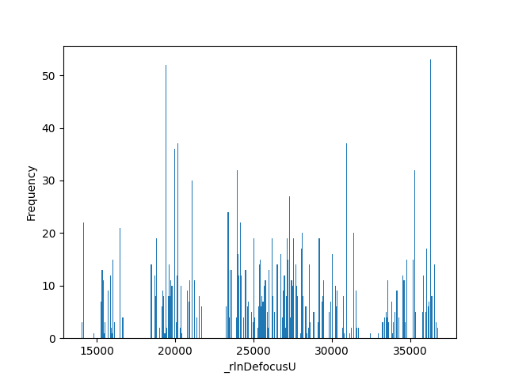

# StarParser

Use this script to manipulate Relion 3.1 star files. See options and examples below.

Usage:

```
python3 starparser.py --i input.star [options]
```

Alternatively, add an alias to your .cshrc (`alias starparser 'python3 /home/scripts/starparser.py'`) and run the script with `starparser --i input.star [options]`	

## Getting Started

* You need to have **Python 3** installed and have the **pandas** and **matplotlib** packages. This is probably best done in a new conda environment: `conda create -n star python=3.6 pandas matplotlib`, which is activated with `conda activate star`.

* Your star file needs to be a standard **Relion 3.1** star file with an optics table, particle table, and particle list with tab delimited columns, (e.g. it does not work on \*\_model.star files).

## Options

### Plotting

* ```--plot_defocus``` Plot defocus to Defocus_histogram.png based on values in the column \_rlnDefocusU. Can be used with -c and -q for a subset, otherwise plots all.

* ```--plot_classparts``` Plot the number of particles per class for all iterations up to the one provided in the input. It can successfully handle filenames that have "\_ct" in them if you've continued from intermediate jobs (only tested on a single continue).

* ```--class_proportion``` Find the proportion of particles that belong to each class. At least two queries (-q, separated by slashes) must be provided along with the column to search in (-c). It will output the proportions and plot the result in Class_proportion.png.

### Modifying

* ```--extract_particles``` Find particles that match a column header (-c) and query (-q) and write them to a new star file (default output.star, or specified with --o).

* ```--delete_column``` Delete column, renumber headers, and output to a new star file (default output.star, or specified with --o). E.g. \_rlnMicrographName. To enter multiple columns, separate them with a slash: \_rlnMicrographName/\_rlnCoordinateX.

* ```--delete_particles``` Delete particles that match a query (specified with -q) within a column header (specified with -c), and write to a new star file (default output.star, or specified with --o).

* ```--max_defocus``` Extract particles with defocus values less than this value (Angstroms). Can be used with -c and -q to only consider a subset.

* ```--swap_columns``` Swap columns from another star file (specified with --f). E.g. \_rlnMicrographName. To enter multiple columns, separate them with a slash: \_rlnMicrographName/\_rlnCoordinateX. Note that the columns should be in the same position in both files. Write the result to a new star file (default output.star, or specified with --o).

* ```--relegate``` Remove optics table and optics column and write to a new star file (default output.star, or specified with --o). This may not be sufficient to be fully compatible with Relion 3.0; use --delete_column to remove other bad columns before this, if necessary. Note that the output star file will no longer be compatible with starparser.

* ```--regroup``` Regroup particles such that those with similar defocus values are in the same group (the size of the group is specified here) and write to a new star file (default output.star, or specified with --o). Any value can be entered. This is useful if there aren't enough particles in each micrograph to make meaningful groups. This only works if \_rlnGroupNumber is being used in the star file rater than \_rlnGroupName. Note that Subset selection in Relion should be used for regrouping if possible (which groups on the \*\_model.star intensity scale factors).

### Data mining

* ```--count_particles``` Count particles and print the result. Can be used with -c and -q for a subset count, otherwise counts all.

* ```--count_mics``` Count the number of unique micrographs. Can be used with -c and -q for a subset count, otherwise counts all.

* ```--list_column``` Write all values of a column to a file (filename will be the name of that column). E.g. \_rlnMicrographName will write to MicrographName.txt. To enter multiple columns, separate them with a slash: \_rlnMicrographName/\_rlnCoordinateX. Can be used with -c and -q for a subset count, otherwise lists all items.

* ```--compare_particles``` Count the number of particles that are shared between the input star file and the one provided here. Also counts the number that are unique to each star file.

### Querying

* ```-c``` Column query. E.g. \_rlnMicrographName. This is used to look for a specific query specified with -q. To enter multiple columns, separate them with a slash: \_rlnMicrographName/\_rlnCoordinateX. Note the single dash in using this option.

* ```-q``` Query term to look for in the column specified by -c. To enter multiple queries, separate them with a slash: 20200101/20200203. Note the single dash in using this option.

### Output

* ```--o``` Output file name. Default is output.star.

* ```--t``` File type of the plot that will be written. Choose between png, jpg, and pdf. Default is png.

### Miscellaneous

* ```--f``` Name of second file to extract columns from. Used with --swap_columns.

---

## Examples

The following examples run the `starparser` command assuming an alias has been created as described above, otherwise, run it with `python3 starparser.py`.

### Plotting

* Plot a histogram of defocus values.
```
starparser --i run_data.star --plot_defocus
```

&nbsp;&nbsp;&nbsp;&nbsp;&nbsp;&#8594;  Output **Defocus_histogram.png**:


---

* Plot a histogram of defocus values from a subset of micrographs that contain "200826" or "200827".

```
starparser --i run_data.star --plot_defocus -c _rlnMicrographName -q 200826/200827
```

&nbsp;&nbsp;&nbsp;&nbsp;&nbsp;&#8594;  Output **Defocus_histogram.png**:


---

* Plot the number of particles per class for the 25 iterations of a Class3D job.

```
starparser --i run_it025_data.star --plot_classparts
```

&nbsp;&nbsp;&nbsp;&nbsp;&nbsp;&#8594;  Output **Class_distribution.png**:


---

* Plot the proportion of particles in each class that belong to 200702 versus 200826 within the \_rlnMicrographName column.

```
starparser --i run_it025_data.star --class_proportion -c _rlnMicrographName -q 200702/200826
```

&nbsp;&nbsp;&nbsp;&nbsp;&nbsp;&#8594;  Output **Class_proportion.png**:


---

### Modifying

* **Delete columns**

```
starparser --i run_data.star --o run_data_delCTFMax_delCTFFoM.star --delete_column _rlnCtfMaxResolution/_rlnCtfFigureOfMerit 
```
&nbsp;&nbsp;&nbsp;&nbsp;&nbsp;&#8594;A new star file named **run_data_delCTFMax_delCTFFoM.star** will be identical to run_data.star except will be missing those two columns. The headers in the particles table will be renumbered.

---

* **Delete a subset of particles**

```
starparser --i run_data.star --o run_data_del200702_del200715.star --delete_particles -c _rlnMicrographName -q 200702/200715
```

&nbsp;&nbsp;&nbsp;&nbsp;&nbsp;&#8594;  A new star file named **run_data_del200702_del200715.star** will be identical to run_data.star except will be any particle that has either 200702 or 2000715 in the \_rlnMicrographName column. In this case, this was useful to delete particles from specific data-collection days.

---

* **Extract a subset of particles**

```
starparser --i run_data.star --o run_data_c1.star --extract_particles -c _rlnClassNumber -q 1
```

&nbsp;&nbsp;&nbsp;&nbsp;&nbsp;&#8594;  A new star file named **run_data_c1.star** will be output with only particles that belong to class #1. In this case, extracting a class here is identical to Subset Selection in Relion (which has more options, including regrouping, etc.).

---

* **Extract particles with specific defoci**

```
starparser --i run_data.star --o run_data_under4um.star --max_defocus 40000
```

&nbsp;&nbsp;&nbsp;&nbsp;&nbsp;&#8594;  A new star file named **run_data_under4um.star** will be output with only particles that have defocus estimations below 4 microns.

---

* **Extract a subset of particles that also have a specific defocus**

```
starparser --i run_data.star --o run_data_under4um_200826.star --max_defocus 40000 -c _rlnMicrographName -q 200826
```

&nbsp;&nbsp;&nbsp;&nbsp;&nbsp;&#8594;  A new star file named **run_data_under4um_200826.star** will be output with only particles that have defocus estimations below 4 microns that also contain 200826 in the \_rlnMicrographName column.

---

* **Swap columns**

```
starparser --i run_data.star --f run_data_2.star --o run_data_swapped.star --swap_columns _rlnAnglePsi/_rlnAngleRot/_rlnAngleTilt/_rlnNormCorrection/_rlnLogLikeliContribution/_rlnMaxValueProbDistribution/_rlnNrOfSignificantSamples/_rlnOriginXAngst/_rlnOriginYAngst
```

&nbsp;&nbsp;&nbsp;&nbsp;&nbsp;&#8594;  A new star file named **run_data_swapped.star** will be output that will be identical to run_data.star except for the columns in the input, which will instead be swapped in from run_data_2.star. This is useful for sourcing alignments from early global refinements.

---

* **Relegate a star file**

```
starparser --i run_data.star --o run_data_3p0.star --relegate
```

&nbsp;&nbsp;&nbsp;&nbsp;&nbsp;&#8594;  A new star file named **run_data_3p0.star** will be output that will be identical to run_data.star except will be missing the optics table and \_rlnOpticsGroup column. The headers in the particles table will be renumbered.

---

### Data mining

* **Count specific particles**

```
starparser --i particles.star --o output.star --count_particles -c _rlnMicrographName -q 200702/200715
```

&nbsp;&nbsp;&nbsp;&nbsp;&nbsp;&#8594;  *There are 7726 particles that match ['200702', '200715'] in the specified columns (out of 69120, or 11.2%).*

---

* **Count the number of micrographs**

```
starparser --i run_data.star --count_mics
```

&nbsp;&nbsp;&nbsp;&nbsp;&nbsp;&#8594;  *There are 7994 unique micrographs in this dataset.*

---

* **Count the number of micrographs for specific particles**

```
starparser --i run_data.star --count_mics -c _rlnMicrographName -q 200826
```

&nbsp;&nbsp;&nbsp;&nbsp;&nbsp;&#8594;  *Creating a subset of 2358 particles that match ['200826'] in the columns ['\_rlnMicrographName'] \(or 3.4%\)*
&nbsp;&nbsp;&nbsp;&nbsp;&nbsp;&#8594;  *There are 288 unique micrographs in this dataset.*

---

* **List all items from a column in a text file**

```
starparser --i run_data.star --list_column _rlnMicrographName
```

&nbsp;&nbsp;&nbsp;&nbsp;&nbsp;&#8594;  All entries of \_rlnMicrographName will be written to *MicrographName.txt* in a single column.

---

* **List all items from multiple columns in independent text files**

```
starparser --i run_data.star --list_column _rlnDefocusU/_rlnCoordinateX
```

&nbsp;&nbsp;&nbsp;&nbsp;&nbsp;&#8594;  All entries of \_rlnDefocusU will be written to *DefocusU.txt* and All entries of \_rlnCoordinateX will be written to *CoordinateX.txt*.

---

* **List all items from a column that match specific particles**

```
starparser --i run_data.star --list_column _rlnDefocusU -c _rlnMicrographName -q 200826
```

&nbsp;&nbsp;&nbsp;&nbsp;&nbsp;&#8594;  Only \_rlnDefocusU entries that have 200826 in \_rlnMicrographName will be written to *DefocusU.txt*.

---


## License

This project is licensed under the MIT License - see the [LICENSE.md](LICENSE.md) file for details.
